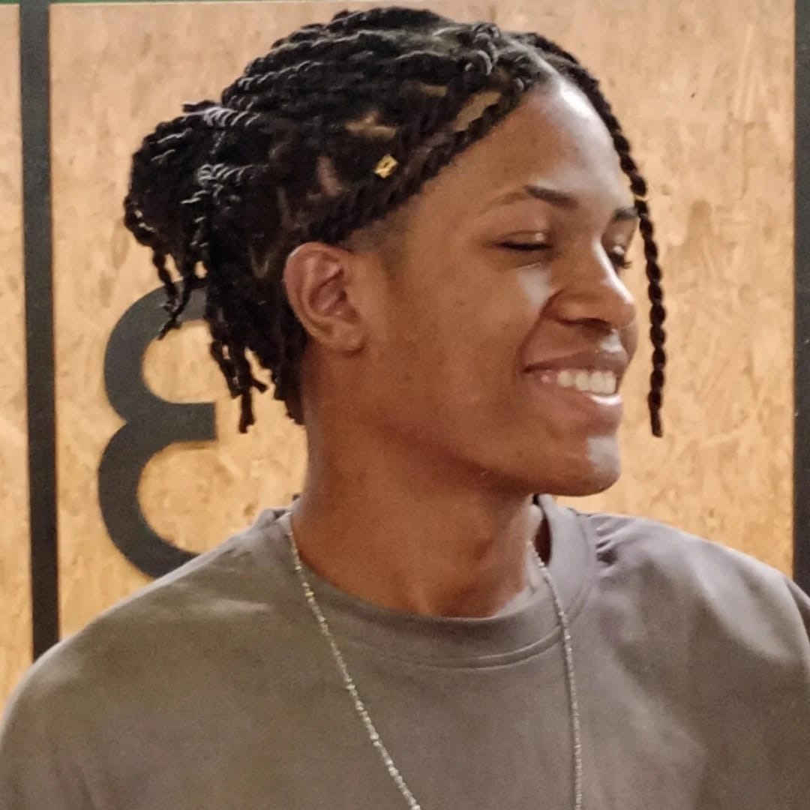

# Portfólio Ramon Miller

Bem-vindo ao meu portfólio! Este projeto foi desenvolvido para apresentar minhas habilidades, experiências e projetos como desenvolvedor.

## ✨ Sobre

Este portfólio é uma página web responsiva, criada para destacar meus principais projetos, experiências profissionais e habilidades técnicas. O objetivo é proporcionar uma navegação agradável e intuitiva para recrutadores, colegas e demais visitantes.

## 🚀 Tecnologias Utilizadas

- **HTML5**  
- **CSS3**  
- **JavaScript**  
- **Responsividade** para diferentes dispositivos

## 📁 Estrutura do Projeto

```
/
├── index.html
├── README.md
├── assets/
│   ├── alura.png
│   ├── favicon-portfolio.png
│   ├── foto-de-perfil.jpg
│   ├── foto-nouhau.png
│   └── projetos/
├── script/
│   └── script.js
└── styles/
    └── styles.css
```

- `index.html`: Página principal do portfólio.
- `assets/`: Imagens e recursos visuais.
- `script/`: Scripts JavaScript para interatividade.
- `styles/`: Arquivos CSS para estilização.

## 🖼️ Funcionalidades

- Apresentação pessoal com foto e descrição.
- Seção de projetos com imagens e links.
- Contato via formulário ou redes sociais.
- Layout responsivo para desktop e mobile.

## 📸 Prévia



## 📦 Como Executar

1. Clone este repositório:
   ```bash
   git clone https://github.com/ramonmiller/portfolio.git
   ```
2. Abra o arquivo `index.html` no seu navegador.

## 📬 Contato

- [LinkedIn](https://www.linkedin.com/in/ramonmiller)
- [E-mail](mailto:ramonmillerdev@gmail.com)

---

Feito com carinho por Ramon Miller.